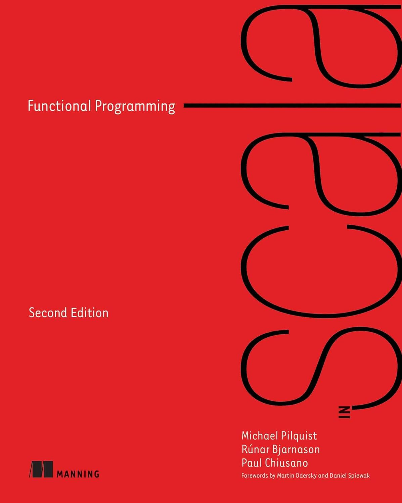

= Functional Programming in Scala in 2023
:source-highlighter: highlightjs
:highlightjs-theme: css/solarized-dark.css
:highlightjsdir: highlight
:revealjs_theme: moon
:revealjs_hash: true
:customcss: css/presentation.css
:icons: font

== Type Classes

[source,scala]
----
package leopards

trait Semigroup[A]:
  def combine(x: A, y: A): A

trait Monoid[A] extends Semigroup[A]:
  def empty: A
----

[%notitle]
=== Type Classes

[source,scala]
----
package leopards

trait Semigroup[A]:
  def combine(x: A, y: A): A
  extension (x: A)                           <1>
    inline def |+|(y: A): A = combine(x, y)

trait Monoid[A] extends Semigroup[A]:
  def empty: A
----
<1> Guilt-free operators

[%notitle]
=== Type Classes

[source,scala]
----
package leopards

given intAdditionMonoid: Monoid[Int] with
  def combine(x: Int, y: Int) = x + y
  def empty = 0
----

[source,scala]
----
scala> import leopards.given
scala> 1 |+| 2
val res0: Int = 3
----

[%notitle, transition=slide-in none]
=== Type Classes

[source,scala]
----
package leopards

given optionMonoid[A: Semigroup]: Monoid[Option[A]] with
  def empty = None
  def combine(x: Option[A], y: Option[A]) =
    x match
      case None => y
      case Some(xx) =>
        y match
          case None     => x
          case Some(yy) => Some(xx |+| yy)
----
[source,scala]
----
scala> import leopards.given
scala> Option(1) |+| Option(2)
val res0: Option[Int] = Some(3)
----

[%notitle, transition=none slide-out]
=== Type Classes

[source,scala]
----
package leopards

given optionMonoid[A](using $sa: Semigroup[A]): Monoid[Option[A]] with
  def empty = None
  def combine(x: Option[A], y: Option[A]) =
    x match
      case None => y
      case Some(xx) =>
        y match
          case None     => x
          case Some(yy) => Some($sa.combine(xx, yy))
----
[source,scala]
----
scala> import leopards.given
scala> Option(1) |+| Option(2)
val res0: Option[Int] = Some(3)
----

[%notitle, transition=slide-in none]
=== Type Classes

[source,scala]
----
package leopards

given mapMonoid[A, B: Semigroup]: Monoid[Map[A, B]] with
  val empty = Map.empty
  def combine(x: Map[A, B], y: Map[A, B]) =
    y.foldLeft(x): 
      case (acc, (k, v)) =>
        acc.updatedWith(k)(_ |+| Some(v))
----

[%notitle, transition=none slide-out]
=== Type Classes

[source,scala]
----
package leopards

given mapMonoid[A, B](using $sb: Semigroup[B]): Monoid[Map[A, B]] with
  val empty = Map.empty
  def combine(x: Map[A, B], y: Map[A, B]) =
    y.foldLeft(x): 
      case (acc, (k, v)) =>
        acc.updatedWith(k)(ov2 =>
          optionMonoid(using $sb).combine(ov2, Some(v)))
----

[%notitle]
=== Type Classes

[source,scala]
----
package leopards

trait Monoid[A] extends Semigroup[A]:
  def empty: A

  extension (as: IterableOnce[A])
    def combineAll: A =
      as.iterator.foldLeft(empty)(combine)
----

[%notitle, transition=slide-in none]
=== Type Classes

[source,scala]
----
package leopards

trait Monoid[A] extends Semigroup[A]:
  def empty: A

  extension (as: IterableOnce[A])
    def combineAll: A =
      as.iterator.foldLeft(empty)(combine)

extension [A](as: IterableOnce[A])
  def foldMap[B](f: A => B)(using m: Monoid[B]): B =
    as.iterator.foldLeft(m.empty)((acc, a) => acc |+| f(a))
----

[%notitle, transition=none slide-out]
=== Type Classes

[source,scala]
----
package leopards

trait Monoid[A] extends Semigroup[A]:
  def empty: A

  extension (as: IterableOnce[A])
    def combineAll: A =
      as.foldMap(identity)(using this)

extension [A](as: IterableOnce[A])
  def foldMap[B](f: A => B)(using m: Monoid[B]): B =
    as.iterator.foldLeft(m.empty)((acc, a) => acc |+| f(a))
----

[%notitle, transition=slide-in none]
=== Type Classes

[source,scala]
----
def bag[A](as: IterableOnce[A]): Map[A, Int] =
  as.foldMap(a => Map(a -> 1))

scala> val charOccurs = bag("scala".toList)
val charOccurs: Map[Char, Int] = Map(s -> 1, c -> 1, a -> 2, l -> 1)
----

[%notitle, transition=none slide-out]
=== Type Classes

[source,scala]
----
def bag[A](as: IterableOnce[A]): Map[A, Int] =
  as.foldMap(a => Map(a -> 1))(using mapMonoid[A, Int](using intAdditionMonoid))

scala> val charOccurs = bag("scala".toList)
val charOccurs: Map[Char, Int] = Map(s -> 1, c -> 1, a -> 2, l -> 1)
----

=== Type Classes in Scala 2

[source,scala]
----
import simulacrum._

@typeclass trait Semigroup[A] {
  @op("|+|") def combine(x: A, y: A): A
}
----

[%notitle]
=== Type Classes in Scala 2

[source,scala]
----
trait Semigroup[A] {
  def combine(x: A, y: A): A
}

object Semigroup {
  def apply[A](implicit instance: Semigroup[A]): Semigroup[A] = instance

  trait Ops[A] {
    def typeClassInstance: Semigroup[A]
    def self: A
    def |+|(y: A): A = typeClassInstance.combine(self, y)
  }

  trait ToSemigroupOps {
    implicit def toSemigroupOps[A](target: A)(implicit tc: Semigroup[A]): Ops[A] = new Ops[A] {
      val self = target
      val typeClassInstance = tc
    }
  }

  object nonInheritedOps extends ToSemigroupOps

  trait AllOps[A] extends Ops[A] {
    def typeClassInstance: Semigroup[A]
  }

  object ops {
    implicit def toAllSemigroupOps[A](target: A)(implicit tc: Semigroup[A]): AllOps[A] = new AllOps[A] {
      val self = target
      val typeClassInstance = tc
    }
  }
}
----

[%notitle]
== FPiS to Scala 2

FPiS => Scala 2

== Misc Notes / Inspiration
- improvements
  - scala 2 stuff
    - right-biased either & try
    - linting (value discard)
    - tie-fighters & \/ & IList
    - sealed abstract case classes?
    - functions & methods & code organization
    - SI-2712, kind projector
  - scala 3
    - enums
    - type classes & extension methods & givens
    - type lambdas
    - derivation
    - tuples (mapN)
- eras: building blocks, infrastructure, fulfillment
- cats 3
- caprese

