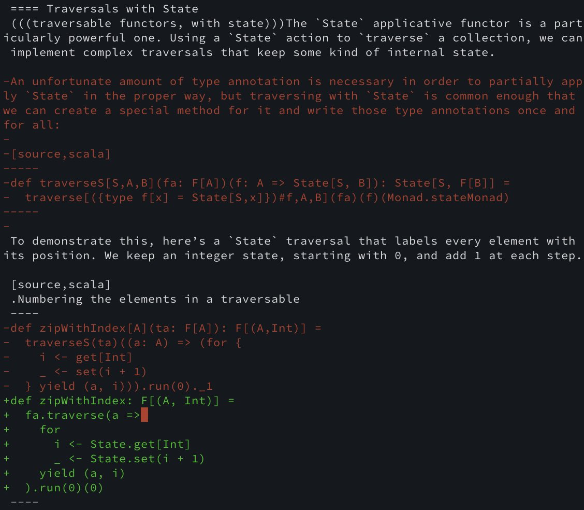

= Functional Programming in Scala in 2023
:source-highlighter: highlightjs
:highlightjs-theme: css/solarized-dark.css
:highlightjsdir: highlight
:revealjs_theme: moon
:revealjs_hash: true
:customcss: css/presentation.css
:icons: font
:revealjs_width: 1200

image::images/fpis-cover.jpg[Cover of FPiS Second Edition,400]

== Type Classes

[source,scala]
----
package leopards

trait Semigroup[A]:
  def combine(x: A, y: A): A

trait Monoid[A] extends Semigroup[A]:
  def empty: A
----

[%notitle]
=== Type Classes

[source,scala]
----
package leopards

trait Semigroup[A]:
  def combine(x: A, y: A): A
  extension (x: A)                           <1>
    inline def |+|(y: A): A = combine(x, y)

trait Monoid[A] extends Semigroup[A]:
  def empty: A
----
<1> Guilt-free operators

[%notitle]
=== Type Classes

[source,scala]
----
package leopards

given intAdditionMonoid: Monoid[Int] with
  def combine(x: Int, y: Int) = x + y
  def empty = 0
----

[source,scala]
----
scala> import leopards.given
scala> 1 |+| 2
val res0: Int = 3
----

[%notitle, transition=slide-in none]
=== Type Classes

[source,scala]
----
package leopards

given optionMonoid[A: Semigroup]: Monoid[Option[A]] with
  def empty = None
  def combine(x: Option[A], y: Option[A]) =
    x match
      case None => y
      case Some(xx) =>
        y match
          case None     => x
          case Some(yy) => Some(xx |+| yy)
----
[source,scala]
----
scala> import leopards.given
scala> Option(1) |+| Option(2)
val res0: Option[Int] = Some(3)
----

[%notitle, transition=none slide-out]
=== Type Classes

[source,scala]
----
package leopards

given optionMonoid[A](using $sa: Semigroup[A]): Monoid[Option[A]] with
  def empty = None
  def combine(x: Option[A], y: Option[A]) =
    x match
      case None => y
      case Some(xx) =>
        y match
          case None     => x
          case Some(yy) => Some($sa.combine(xx, yy))
----
[source,scala]
----
scala> import leopards.given
scala> Option(1) |+| Option(2)
val res0: Option[Int] = Some(3)
----

[%notitle, transition=slide-in none]
=== Type Classes

[source,scala]
----
package leopards

given mapMonoid[A, B: Semigroup]: Monoid[Map[A, B]] with
  val empty = Map.empty
  def combine(x: Map[A, B], y: Map[A, B]) =
    y.foldLeft(x): 
      case (acc, (k, v)) =>
        acc.updatedWith(k)(_ |+| Some(v))
----

[%notitle, transition=none slide-out]
=== Type Classes

[source,scala]
----
package leopards

given mapMonoid[A, B](using $sb: Semigroup[B]): Monoid[Map[A, B]] with
  val empty = Map.empty
  def combine(x: Map[A, B], y: Map[A, B]) =
    y.foldLeft(x): 
      case (acc, (k, v)) =>
        acc.updatedWith(k)(ov2 =>
          optionMonoid(using $sb).combine(ov2, Some(v)))
----

[%notitle]
=== Type Classes

[source,scala]
----
package leopards

trait Monoid[A] extends Semigroup[A]:
  def empty: A

  extension (as: IterableOnce[A])
    def combineAll: A =
      as.iterator.foldLeft(empty)(combine)
----

[%notitle, transition=slide-in none]
=== Type Classes

[source,scala]
----
package leopards

trait Monoid[A] extends Semigroup[A]:
  def empty: A

  extension (as: IterableOnce[A])
    def combineAll: A =
      as.iterator.foldLeft(empty)(combine)

extension [A](as: IterableOnce[A])
  def foldMap[B](f: A => B)(using m: Monoid[B]): B =
    as.iterator.foldLeft(m.empty)((acc, a) => acc |+| f(a))
----

[%notitle, transition=none slide-out]
=== Type Classes

[source,scala]
----
package leopards

trait Monoid[A] extends Semigroup[A]:
  def empty: A

  extension (as: IterableOnce[A])
    def combineAll: A =
      as.foldMap(identity)(using this)

extension [A](as: IterableOnce[A])
  def foldMap[B](f: A => B)(using m: Monoid[B]): B =
    as.iterator.foldLeft(m.empty)((acc, a) => acc |+| f(a))
----

[%notitle, transition=slide-in none]
=== Type Classes

[source,scala]
----
def bag[A](as: IterableOnce[A]): Map[A, Int] =
  as.foldMap(a => Map(a -> 1))

scala> val charOccurs = bag("scala".toList)
val charOccurs: Map[Char, Int] = Map(s -> 1, c -> 1, a -> 2, l -> 1)
----

[%notitle, transition=none slide-out]
=== Type Classes

[source,scala]
----
def bag[A](as: IterableOnce[A]): Map[A, Int] =
  as.foldMap(a => Map(a -> 1))(using mapMonoid[A, Int](using intAdditionMonoid))

scala> val charOccurs = bag("scala".toList)
val charOccurs: Map[Char, Int] = Map(s -> 1, c -> 1, a -> 2, l -> 1)
----

=== Type Classes in Scala 2

[source,scala]
----
import simulacrum._

@typeclass trait Semigroup[A] {
  @op("|+|") def combine(x: A, y: A): A
}
----

[%notitle]
=== Type Classes in Scala 2

[source,scala]
----
trait Semigroup[A] {
  def combine(x: A, y: A): A
}

object Semigroup {
  def apply[A](implicit instance: Semigroup[A]): Semigroup[A] = instance

  trait Ops[A] {
    def typeClassInstance: Semigroup[A]
    def self: A
    def |+|(y: A): A = typeClassInstance.combine(self, y)
  }

  trait ToSemigroupOps {
    implicit def toSemigroupOps[A](target: A)(implicit tc: Semigroup[A]): Ops[A] = new Ops[A] {
      val self = target
      val typeClassInstance = tc
    }
  }

  object nonInheritedOps extends ToSemigroupOps

  trait AllOps[A] extends Ops[A] {
    def typeClassInstance: Semigroup[A]
  }

  object ops {
    implicit def toAllSemigroupOps[A](target: A)(implicit tc: Semigroup[A]): AllOps[A] = new AllOps[A] {
      val self = target
      val typeClassInstance = tc
    }
  }
}
----

[%notitle]
== FPiS to Scala 2

FPiS => Scala 2

[%notitle]
=== FPiS to Scala 2

[%header,format=dsv]
|===
Feature:Scala 2:Scala 3
Type classes:Simulacrum:Built-in
Type lambdas:Kind Projector:Built-in (-Ykind-projector)
Arity & data polymorphism:Shapeless:Built-in
Derivation:Shapeless:Built-in
Partial unification (SI-2712):-Ypartial-unification (2.11+):Built-in
Enumerations & ADTs:Enumeratum et al:Built-in
|===

[%notitle]
=== FPiS to Scala 2

=== 😱 Composition in Scalaz

[source,scala]
----
val vname = validateName(name)
val vbday = validateBirthday(bday)
val vphone = validatePhone(phone)

val personInfo = (vname |@| vbday |@| vphone)(PersonInfo(_, _, _))
----

[.notes]
- DSL implemented with `ApplicativeBuilder{N}` types
- Supports composing up to 12 values

=== 😱 Composition in Cats

[source,scala]
----
val vname = validateName(name)
val vbday = validateBirthday(bday)
val vphone = validatePhone(phone)

val personInfo = (vname, vbday, vphone).mapN(PersonInfo(_, _, _))
----

[.notes]
- Replaces DSL with regular tuples
- Syntax enrichments generated at build time (of cats-core) with a source generator
- Supports composing up to 22 values

=== 😱 Composition in Scala 3

[source,scala]
----
trait Apply[F[_]] extends Functor[F], Semigroupal[F]:
  extension [A](fa: F[A]) def map2[B, Z](fb: F[B])(f: (A, B) => Z): F[Z]

  extension [T <: NonEmptyTuple](tuple: T)
    def mapN[B](using Tuple.IsMappedBy[F][T])(f: Tuple.InverseMap[T, F] => B): F[B] =
      t.tupled.map(f)

    def tupled(using Tuple.IsMappedBy[F][T]): F[Tuple.InverseMap[T, F]] =
      ???
----

=== 😱 Composition in Scala 3

[source,scala]
----
trait Apply[F[_]] extends Functor[F], Semigroupal[F]:
  extension [A](fa: F[A]) def map2[B, Z](fb: F[B])(f: (A, B) => Z): F[Z]

  extension [T <: NonEmptyTuple](tuple: T)
    def mapN[B](using Tuple.IsMappedBy[F][T])(f: Tuple.InverseMap[T, F] => B): F[B] =
      t.tupled.map(f)

    def tupled(using Tuple.IsMappedBy[F][T]): F[Tuple.InverseMap[T, F]] =
      def loop[X <: NonEmptyTuple](x: X): F[NonEmptyTuple] = x match
        case (hd: F[a] @unchecked) *: EmptyTuple =>
          hd.map(_ *: EmptyTuple)
        case (hd: F[a] @unchecked) *: (tl: NonEmptyTuple) =>
          val tail = loop(tl)
          hd.map2(tail)(_ *: _)
      loop(t).asInstanceOf[F[Tuple.InverseMap[T, F]]]
----
[.notes]
* Efficient but requires casting / type checks

=== 😱 Composition in Scala 3

[source,scala]
----
trait Apply[F[_]] extends Functor[F], Semigroupal[F]:
  extension [A](fa: F[A]) def map2[B, Z](fb: F[B])(f: (A, B) => Z): F[Z]

  extension [T <: NonEmptyTuple](tuple: T)
    inline def mapN[B](using Tuple.IsMappedBy[F][T])(f: Tuple.InverseMap[T, F] => B): F[B] =
      t.tupled.map(f)

    inline def tupled(using m: Tuple.IsMappedBy[F][T]): F[Tuple.InverseMap[T, F]] =
      tupledGeneric(m(t))

  private case class IsMap[T <: Tuple](value: Tuple.Map[T, F])

  private inline def tupledGeneric[X <: Tuple](x: Tuple.Map[X, F]): F[X] =
    inline IsMap(x) match
      case t: IsMap[h *: EmptyTuple] => t.value.head.map(_ *: EmptyTuple)
      case t: IsMap[h *: t] =>
        val head = t.value.head
        val tail = tupledGeneric(t.value.tail)
        head.map2(tail)(_ *: _)
----
[.notes]
* Type safe but runtime overhead
* Courtesy of Daniel Beskin (@ncreep)

== Transformers

TODO
Opaque types & extension methods

== Derivation

TODO

[%notitle]
== Cats 3
s/leopards/cats/

[%notitle]
=== Cats 3

[source,scala]
----
import cats.syntax.all.*
----

vs.

[source,scala]
----
import cats.given
----

=== Tuckman Model of Functional Scala
[cols="1,3"]
|===
|Forming
|Melting pot of styles; heavy influence from Haskell
|Storming
|Typelevel founded; scalac forked; Cats founded; integration painful
|Norming
|Cats, Cats Effect, & FS2 emerge as key infrastructure, enabling proliferation of interoperable libraries
|Performing
|Industrial grade, performant, integrated infrastructure; cross-platform; focus on application development
|===

=== Headwinds

* Improvements to Java & Kotlin
** Loom
** Coroutines
** Records
* Direct Style 

[%notitle]
=== Final

"Just as the past eight years have brought about a sea change in the nature of the Scala ecosystem and the context in which we evaluate and employ functional techniques, so too will the coming eight years bring about evolution and innovation. Perhaps when it comes time to update this volume once again, names such as Cats Effect will seem as dated and ancestral as Scalaz seems to us today."

-- Daniel Spiewak, Foreword to FPiS